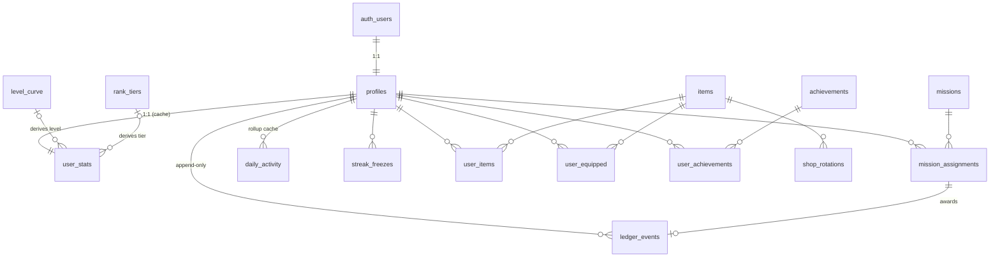

# Ascend — Database Design

> **Status:** Implemented — see `supabase/migrations/`.
> **Last updated:** 2026-07-20

This document is the source of truth for *why* the database looks the way it does.
The migrations in `supabase/migrations/` are the source of truth for *what* it is.

**Why this file exists:** v1 of Ascend was lost because the schema lived only in the
Supabase dashboard SQL editor. Nothing was in git, so when the database died, the
design died with it. That must never be true again. If you change the schema, change
this file in the same commit.

---

## 0. Context & constraints

| Constraint | Value | Consequence for the design |
|---|---|---|
| Frontend | Vite + React 18 SPA (**not** Next.js) | **There is no server.** The browser holds the anon key and talks directly to Postgres. |
| Auth | Supabase Auth | `profiles.id` is a 1:1 FK to `auth.users.id`. |
| Plan | **Free** | 7-day backups, **no PITR**, project pauses after ~7d idle. External backup is mandatory, not optional. |
| Dev workflow | Solo, no Docker, push directly | Migrations as committed `.sql` files applied with `supabase db push` (no Docker needed). |
| Priority | Clarity over cleverness | Fewer, well-named tables. No polymorphic magic. |

### The single most important consequence

Because there is **no backend**, a malicious user can call any table or RPC directly
with your anon key. Therefore:

> **The client gets READ-only RLS. Every write that affects XP, coins, items or
> streaks goes through a `SECURITY DEFINER` function.**

If users could `INSERT` into the ledger, they could grant themselves infinite XP with
one line of JavaScript in the browser console. This rule is not negotiable and it
shapes every table below.

---

## 1. Design principles

1. **The ledger is the truth.** `ledger_events` is append-only. Every number on a
   profile (XP, level, coins, stats) is a *cache* that can be thrown away and rebuilt.
2. **Never `UPDATE` or `DELETE` history.** Corrections are compensating rows that
   point back at what they reverse.
3. **Catalog rows are referenced by `code`, never by generated id.** Seed data uses
   `'run_5k'`, not a UUID. This makes seeds idempotent and re-runnable forever.
4. **Config in data, not in DDL.** New missions, achievements, cosmetics, level curves
   and rank tiers are all *rows*. Adding content must never require a migration.
5. **Every FK declares its `ON DELETE` explicitly.** No defaults.
6. **All timestamps `TIMESTAMPTZ`.** Plus a frozen `local_date` where a day matters.

---

## 2. Entity-relationship diagram



**Table count: 14.** The old schema had ~13 with six of them doing cosmetics alone;
this one covers more features with clearer boundaries.

---

## 3. Enums

Postgres enums require a migration to extend, so they are used **only** for values
that are structural (changing them means changing code anyway). Anything that is
*content* is a lookup table instead.

```
attribute_type  : health | money | discipline
rarity_type     : common | rare | epic | legendary
cadence_type    : daily | weekly
ledger_kind     : mission_daily | mission_weekly | streak_bonus | achievement
                  | purchase | refund | correction | admin_grant
acquisition_type: shop | achievement | level | seasonal | starter
```

`item_type` is deliberately **`text` + a `slots` lookup table**, not an enum — you
will invent new cosmetic slots (banner, nameplate, emote, border…) and that must not
cost a migration.

---

## 4. Tables

### 4.1 `profiles` — identity & settings (MUTABLE)

1:1 with `auth.users`. Contains only things the user *sets*, never things the system
*derives*.

| Column | Type | Notes |
|---|---|---|
| `id` | `uuid` PK | FK → `auth.users(id)` **ON DELETE CASCADE** |
| `username` | `citext` UNIQUE | `CHECK (username ~ '^[A-Z0-9_]{3,20}$')` — matches existing client validation |
| `avatar_url` | `text` | Supabase Storage public URL |
| `timezone` | `text` NOT NULL DEFAULT `'Europe/Madrid'` | IANA name, `CHECK` valid via `pg_timezone_names` |
| `day_cutoff_hour` | `smallint` NOT NULL DEFAULT `4` | `CHECK 0..23` — see §6 |
| `mission_categories` | `attribute_type[]` NOT NULL DEFAULT all three | onboarding preference |
| `onboarded_at` | `timestamptz` NULL | NULL = show onboarding |
| `deleted_at` | `timestamptz` NULL | soft delete, see §8 |
| `created_at` / `updated_at` | `timestamptz` NOT NULL | `updated_at` maintained by trigger |

**Why separate from `user_stats`:** settings are written by the user; stats are written
only by the system. Splitting them means the "rebuild all derived data" operation
touches exactly one table and can never clobber a user's timezone or username. It also
lets RLS be stricter on stats than on profiles.

**Populated by trigger** on `auth.users` insert, reading `raw_user_meta_data.username`
— which is exactly what [`auth.js`](../src/lib/api/auth.js) already sends.

---

### 4.2 `user_stats` — derived cache (MUTABLE, REBUILDABLE)

1:1 with `profiles`. **Every column here is a cache.** Deleting the whole table and
recomputing it from `ledger_events` + `mission_assignments` must produce identical
values. That property is the whole point.

| Column | Type | Derived from |
|---|---|---|
| `user_id` | `uuid` PK | FK → `profiles(id)` **ON DELETE CASCADE** |
| `total_xp` | `bigint` NOT NULL DEFAULT 0 | `SUM(xp_delta)` |
| `coins` | `bigint` NOT NULL DEFAULT 0 | `SUM(coins_delta)` — `CHECK (coins >= 0)` |
| `level` | `int` NOT NULL DEFAULT 1 | `level_curve` lookup on `total_xp` |
| `xp_into_level` / `xp_next` | `int` | `level_curve` arithmetic |
| `stat_health` / `stat_money` / `stat_discipline` | `int` | `SUM(xp_delta) GROUP BY attribute` |
| `streak_current` / `streak_longest` | `int` | walk of `daily_activity` + `streak_freezes` |
| `last_active_local_date` | `date` | `MAX(local_date)` in `daily_activity` |
| `recomputed_at` | `timestamptz` | when the rebuild function last ran |

**Why cache at all?** Because the leaderboard needs `ORDER BY total_xp DESC` across
all users, and recomputing that from the ledger on every page load would be absurd.
The cache is an optimisation; the ledger is the truth.

---

### 4.3 `ledger_events` — **APPEND-ONLY. The source of truth.** ⭐

The most important table in the database.

| Column | Type | Notes |
|---|---|---|
| `id` | `bigint` GENERATED ALWAYS AS IDENTITY PK | monotonic = natural ordering |
| `user_id` | `uuid` NOT NULL | FK → `profiles(id)` **ON DELETE CASCADE** |
| `kind` | `ledger_kind` NOT NULL | what happened |
| `xp_delta` | `int` NOT NULL DEFAULT 0 | may be negative (corrections) |
| `coins_delta` | `int` NOT NULL DEFAULT 0 | negative on purchase |
| `attribute` | `attribute_type` NULL | drives `stat_*`; NULL for purchases |
| `occurred_at` | `timestamptz` NOT NULL DEFAULT `now()` | absolute instant |
| `local_date` | `date` NOT NULL | **frozen at insert**, see §6 |
| `assignment_id` | `bigint` NULL | FK → `mission_assignments(id)` **ON DELETE RESTRICT** |
| `achievement_id` | `uuid` NULL | FK → `achievements(id)` **ON DELETE RESTRICT** |
| `item_id` | `uuid` NULL | FK → `items(id)` **ON DELETE RESTRICT** |
| `reverses_id` | `bigint` NULL UNIQUE | FK → `ledger_events(id)` **ON DELETE RESTRICT** |
| `idempotency_key` | `text` NOT NULL | UNIQUE per user — see below |
| `notes` | `text` NULL | admin/debug context |

**Why XP and coins in one table.** Completing a mission grants both. Two tables would
mean two inserts and a window where one succeeded and the other didn't. One row is
atomic by construction — it is *impossible* to award XP without the matching coins.

**`ON DELETE RESTRICT` everywhere except `user_id`.** You must not be able to delete a
mission or item that history references. The ledger pins the catalog in place. Retire
content with `is_active = false`, never `DELETE`.

**`idempotency_key` is the anti-double-award guard.** Format:
`'mission:{assignment_id}'`, `'achievement:{achievement_id}'`, `'purchase:{item_id}:{timestamp}'`.
With `UNIQUE (user_id, idempotency_key)`, a double-clicked "complete" button, a retried
request, or a network hiccup can physically never award XP twice. This is the class of
bug that silently corrupts gamified apps.

**Corrections never delete.** Un-completing a mission inserts a *new* row with negated
deltas and `reverses_id` pointing at the original. `UNIQUE` on `reverses_id` means an
event can be reversed at most once. Net state is always `SUM(xp_delta)`; the full
history survives.

> **Nothing in the client may ever write to this table.** No `INSERT`/`UPDATE`/`DELETE`
> grant to `authenticated`. Writes come only from `SECURITY DEFINER` functions.

---

### 4.4 `missions` — content catalog (MUTABLE, but append-in-practice)

| Column | Type | Notes |
|---|---|---|
| `id` | `uuid` PK DEFAULT `gen_random_uuid()` | |
| `code` | `text` UNIQUE NOT NULL | stable slug, e.g. `run_5k` — **seeds reference this** |
| `name` / `description` | `jsonb` NOT NULL | `{"en": "...", "es": "..."}` |
| `cadence` | `cadence_type` NOT NULL | daily or weekly |
| `attribute` | `attribute_type` NOT NULL | health / money / discipline |
| `rarity` | `rarity_type` NOT NULL | drives assignment weighting |
| `xp_reward` / `coins_reward` | `int` NOT NULL | `CHECK >= 0` |
| `icon` | `text` NOT NULL | lucide-react icon name |
| `target_value` / `target_unit` | `numeric` / `text` NULL | optional: "5" / "km" — display only for now |
| `is_active` | `boolean` NOT NULL DEFAULT true | retire without deleting |
| `created_at` | `timestamptz` | |

**Why `jsonb` for translations instead of a `mission_translations` table.** Strict
normalization says a separate table. But translations are *always* fetched with their
mission and never queried independently, so a join would cost on every read and buy
nothing. The app supports exactly two locales ([`i18n/`](../src/i18n/)). A `CHECK`
enforcing both keys exist gives the integrity a table would have provided. This is a
deliberate, justified denormalization — the only one in the schema.

**Why `code`.** If seeds referenced UUIDs, re-running them after a rebuild would create
duplicates. `INSERT ... ON CONFLICT (code) DO UPDATE` is idempotent forever.

---

### 4.5 `mission_assignments` — what was assigned (APPEND-ONLY, one mutable flag)

**This replaces the old `user_daily_missions` + `user_weekly_missions`.** They were
near-identical tables differing only by `assigned_date` vs `week_start` — every query,
RPC and policy had to be written twice. One table with a period model removes that
entire class of duplication.

| Column | Type | Notes |
|---|---|---|
| `id` | `bigint` IDENTITY PK | |
| `user_id` | `uuid` NOT NULL | FK → `profiles(id)` **ON DELETE CASCADE** |
| `mission_id` | `uuid` NOT NULL | FK → `missions(id)` **ON DELETE RESTRICT** |
| `cadence` | `cadence_type` NOT NULL | denormalized from mission for indexing |
| `period_start` | `date` NOT NULL | daily → that local date; weekly → that Monday |
| `assigned_at` | `timestamptz` NOT NULL | |
| `completed_at` | `timestamptz` NULL | **the one mutable column** |
| `xp_awarded` / `coins_awarded` | `int` NULL | snapshot of reward at completion time |

`UNIQUE (user_id, mission_id, cadence, period_start)` — this constraint is what makes
`ensure_daily_missions()` idempotent. Call it fifty times, get one assignment.

**Why `completed_at` is mutable when everything else is append-only.** Pragmatism, and
it costs nothing: the ledger already records the completion *and* any reversal, so
history is fully preserved. A separate `mission_completions` table would be purer but
adds a join to the app's single hottest query for zero extra auditability.

**Why snapshot `xp_awarded`.** If you rebalance a mission from 50 → 80 XP next year,
history must still show what was actually earned. Never recompute past rewards from the
current catalog.

---

### 4.6 `daily_activity` — per-day rollup (CACHE, REBUILDABLE)

| Column | Type |
|---|---|
| `user_id` + `local_date` | composite PK, FK → `profiles(id)` **ON DELETE CASCADE** |
| `missions_completed` | `int` NOT NULL DEFAULT 0 |
| `xp_earned` / `coins_earned` | `int` NOT NULL DEFAULT 0 |
| `counts_for_streak` | `boolean` NOT NULL |
| `freeze_applied` | `boolean` NOT NULL DEFAULT false |

Pure `GROUP BY` of the ledger. Exists because the weekly XP chart and streak walk both
need "per day" data, and scanning the full ledger for a 7-day chart gets slower forever
while this stays constant-size. Maintained by trigger on ledger insert; fully
rebuildable.

---

### 4.7 `streak_freezes` — (APPEND-ONLY)

| Column | Type | Notes |
|---|---|---|
| `id` | `bigint` IDENTITY PK | |
| `user_id` | `uuid` NOT NULL | FK → `profiles(id)` **ON DELETE CASCADE** |
| `granted_at` | `timestamptz` NOT NULL | |
| `source` | `text` NOT NULL | `achievement` / `purchase` / `level` / `admin` |
| `consumed_for_date` | `date` NULL UNIQUE-per-user | NULL = still banked |

Balance = `COUNT(*) WHERE consumed_for_date IS NULL`. Never decrement a counter;
consuming a freeze sets the date on one row. `UNIQUE (user_id, consumed_for_date)`
prevents burning two freezes on the same day.

**Recommended rules** (all tunable in data, not DDL): max 3 banked, auto-applied when a
day is missed, earned every 7 consecutive days.

---

### 4.8 `items` + `user_items` + `user_equipped` — cosmetics ⭐

**This is the biggest structural win over v1.** The old schema had `titles`,
`cosmetics`, `shop_items`, `user_titles`, `user_cosmetics`, `user_shop_items` — six
tables — *plus* seven `active_*_id` columns on `profiles`
(see [`profile.js`](../src/lib/api/profile.js)). Adding one new cosmetic type meant a
new table, a new join table, a new profile column, and edits to every profile query.

Three tables replace all of it, and new cosmetic types cost **zero migrations**.

**`items`** (catalog):

| Column | Type | Notes |
|---|---|---|
| `id` | `uuid` PK | |
| `code` | `text` UNIQUE NOT NULL | stable slug |
| `item_type` | `text` NOT NULL | FK → `slots(code)` — `title`, `frame`, `banner`, `nameplate`, `emote`… |
| `name` / `description` | `jsonb` NOT NULL | |
| `rarity` | `rarity_type` NOT NULL | |
| `config` | `jsonb` NOT NULL DEFAULT `'{}'` | colors, asset URLs, CSS — **render config lives here, not in columns** |
| `acquisition` | `acquisition_type` NOT NULL | how it's obtained |
| `price_coins` | `int` NULL | required when `acquisition = 'shop'` (CHECK) |
| `unlock_level` | `int` NULL | required when `acquisition = 'level'` (CHECK) |
| `unlock_achievement_id` | `uuid` NULL | FK → `achievements(id)` **ON DELETE RESTRICT** |
| `is_active` | `boolean` NOT NULL DEFAULT true | |

**`user_items`** (ownership, append-only): `user_id`, `item_id`, `acquired_at`,
`acquired_via`, `ledger_event_id`. `UNIQUE (user_id, item_id)` — can't buy twice.

**`user_equipped`** (loadout, mutable): `user_id`, `slot`, `item_id`.
`PRIMARY KEY (user_id, slot)` — one item per slot, enforced structurally instead of by
seven nullable columns. A trigger validates the user owns the item and that
`items.item_type = slot`.

**`slots`** is a tiny lookup table (`code`, `label jsonb`, `sort_order`). Adding an
"avatar border" slot is one `INSERT`.

---

### 4.9 `shop_rotations` — (APPEND-ONLY)

`rotation_date` (date) + `item_id` composite PK, `price_coins` (**price snapshot**),
`slot_index`. Global rotation — same shop for everyone, which is what
`ensure_shop_rotation()` in [`shop.js`](../src/lib/api/shop.js) already implies and is
far simpler than per-user rotations.

Price is snapshotted so a historical purchase always reconciles against what was
actually charged.

---

### 4.10 `achievements` + `user_achievements`

**`achievements`**: `id`, `code` UNIQUE, `name`/`description` `jsonb`, `rarity`, `icon`,
`xp_reward`, `coins_reward`, `criteria jsonb`, `is_active`.

**`criteria` as `jsonb` is what delivers your "no migrations for new content"
requirement.** Examples:

```json
{ "type": "streak_reach",     "value": 30 }
{ "type": "missions_total",   "value": 100 }
{ "type": "attribute_xp",     "attribute": "health", "value": 5000 }
{ "type": "level_reach",      "value": 25 }
```

One evaluator function reads these. A new achievement is an `INSERT`, never a migration.

**`user_achievements`**: `user_id`, `achievement_id`, `unlocked_at`, `ledger_event_id`.
`UNIQUE (user_id, achievement_id)` — idempotent unlocking.

---

### 4.11 `level_curve` and `rank_tiers` — tunable progression

**`level_curve`**: `level` (int PK), `cumulative_xp` (bigint UNIQUE), `title` (jsonb).

A **table, not a formula.** `level = MAX(level) WHERE cumulative_xp <= total_xp`. Seeded
by a formula, but stored as rows so you can rebalance progression by updating data
instead of shipping a migration and re-deriving every user.

**`rank_tiers`** (your LoL soloq ladder): `code` (`bronze`, `silver`, … `challenger`),
`name jsonb`, `min_total_xp`, `icon`, `color`, `sort_order`. Same reasoning — retune the
ladder without touching DDL.

---

## 5. Explicit callouts

### 5.1 Append-only vs mutable

| Table | Mode |
|---|---|
| `ledger_events` | **Append-only.** Trigger blocks `UPDATE`/`DELETE`. |
| `user_items`, `user_achievements`, `shop_rotations`, `streak_freezes`¹ | **Append-only.** |
| `mission_assignments` | Append-only except `completed_at` / award snapshots. |
| `profiles`, `user_equipped` | Mutable (user-controlled settings). |
| `user_stats`, `daily_activity` | Mutable **caches** — safe to wipe and rebuild. |
| `missions`, `items`, `achievements`, `level_curve`, `rank_tiers`, `slots` | Catalog — update freely, but **retire via `is_active`, never `DELETE`**. |

¹ `streak_freezes` allows exactly one transition: `consumed_for_date` NULL → set.

### 5.2 Indexes and why

| Index | Serves |
|---|---|
| `ledger_events (user_id, local_date)` | weekly XP chart, daily rollups |
| `ledger_events (user_id, occurred_at DESC)` | recent activity feed |
| **`ledger_events UNIQUE (user_id, idempotency_key)`** | correctness, not speed — the double-award guard |
| `ledger_events UNIQUE (reverses_id)` | one reversal per event |
| **`mission_assignments UNIQUE (user_id, mission_id, cadence, period_start)`** | makes `ensure_*` idempotent |
| `mission_assignments (user_id, cadence, period_start)` | **the hottest query** — today's mission list |
| `mission_assignments (user_id, period_start) WHERE completed_at IS NULL` | partial index: open missions |
| `user_stats (total_xp DESC)` | leaderboard ordering |
| `daily_activity (user_id, local_date DESC)` | streak walk, charts |
| `missions (cadence, attribute) WHERE is_active` | partial: assignment pool |
| `items (item_type) WHERE is_active` | shop and rewards pages |
| `user_items (user_id)` / `user_achievements (user_id)` | ownership lookups |
| every FK column | Postgres does **not** auto-index FKs; unindexed FKs make cascades slow |

No index exists here without a query that needs it.

### 5.3 Timezones ⚠️

The rule: **store the absolute instant *and* the day it counted for.**

- `profiles.timezone` — IANA name (`Europe/Madrid`), captured at signup.
- `profiles.day_cutoff_hour` — default **4am**, not midnight. Someone logging a run at
  1:30am is finishing *yesterday*, and treating that as a missed day is the single most
  common "your app broke my streak" complaint.
- Every row that belongs to a day stores **both** `occurred_at TIMESTAMPTZ` and
  `local_date DATE`.

```
local_date = ((occurred_at AT TIME ZONE profiles.timezone)
              - make_interval(hours => profiles.day_cutoff_hour))::date
```

**`local_date` is computed once at insert and then frozen forever.** If a user flies to
Japan and updates their timezone, past days keep the dates they were earned on. The
alternative — recomputing history — would retroactively shift days, merge or split
them, and silently break streaks. Future rows use the new timezone; the past is
immutable.

**Weekly periods** use `date_trunc('week', local_date)` — Postgres weeks start Monday,
matching the app. This fixes a live bug: [`missions.js:4`](../src/lib/api/missions.js#L4)
currently computes the week start in **browser-local time** and sends it to a UTC
database, so users near midnight get the wrong week. In the new design the client never
computes dates at all — the server does, from the user's stored timezone.

> **Rule: the client must never compute a date.** It has no authority over what "today"
> means. Every date comes from the database.

### 5.4 Soft deletes

Three different policies, because "delete" means three different things:

1. **Catalog content** (missions, items, achievements) — never deleted. `is_active =
   false`. The ledger references them with `ON DELETE RESTRICT`, so the database
   physically refuses to let history dangle.
2. **User accounts** — soft first: set `profiles.deleted_at`, which hides the user from
   leaderboards and blocks logins, while keeping data recoverable for **30 days** (a
   real user changing their mind, or a mistake).
3. **GDPR hard delete** — you're in Spain, so this is a legal requirement, not a nicety.
   After 30 days a scheduled job deletes the `auth.users` row; `ON DELETE CASCADE`
   propagates through `profiles` and every user-owned table. Leaderboard history
   disappears with them, which is the correct GDPR outcome.

Every user-facing query filters `deleted_at IS NULL`, enforced in RLS rather than
remembered by hand at each call site.

### 5.5 How XP, coins, level and streak are derivable

The recovery guarantee: **if `user_stats` and `daily_activity` are ever wrong, delete
them and rebuild.**

| Value | Derivation |
|---|---|
| `total_xp` | `SUM(xp_delta) FROM ledger_events WHERE user_id = ?` |
| `coins` | `SUM(coins_delta)` — earnings and purchases in the same ledger, so it always reconciles |
| `stat_health` etc. | `SUM(xp_delta) GROUP BY attribute` |
| `level` | `MAX(level) FROM level_curve WHERE cumulative_xp <= total_xp` |
| `rank tier` | `rank_tiers` lookup on `total_xp` |
| active days | `daily_activity WHERE counts_for_streak` |
| `streak_current` | walk back from today; each day must be active **or** freeze-covered |
| `streak_longest` | longest such run over all history |

Phase 4 ships this as a single `recompute_user_stats(user_id)` function plus a
`recompute_all_stats()` wrapper. Run it nightly via `pg_cron` and any drift between
cache and truth self-heals within 24 hours — instead of compounding silently for months,
which is how gamified apps normally rot.

**Streak bonuses must stay deterministic.** A bonus is a function of streak length
(e.g. `floor(streak / 7) * 10`), never random. If it were random, a replay could not
reproduce history and the ledger would stop being authoritative.

---

## 6. PHASE 3 — Resilience

### 6.1 Supabase-specific practices

**RLS on every table from day one.** The pattern, given the anon key is in the browser:

| Table group | `SELECT` | `INSERT` / `UPDATE` / `DELETE` |
|---|---|---|
| `ledger_events`, `mission_assignments`, `user_items`, `user_achievements`, `streak_freezes`, `daily_activity`, `user_stats` | own rows only (`auth.uid() = user_id`) | **none — no grant at all** |
| `profiles` | own row only | `UPDATE` own row, restricted column list |
| `user_equipped` | own rows | `INSERT`/`UPDATE`/`DELETE` own, trigger-validated |
| Catalog (`missions`, `items`, `achievements`, `slots`, `level_curve`, `rank_tiers`, `shop_rotations`) | any authenticated user | none (service role only) |

Other users' profiles are **never** directly selectable — the leaderboard goes through a
`SECURITY DEFINER` function returning only safe columns. Otherwise "show the ladder"
quietly becomes "let anyone dump every user row."

**`SECURITY DEFINER` hygiene.** Every such function gets `SET search_path = ''` and
fully-qualified names (`public.ledger_events`). Without this a user can create objects
in their own schema and hijack the function's elevated privileges. This is the standard
Postgres privilege-escalation vector and it is easy to get wrong.

**Writes that must be functions, not table access:**
`complete_mission`, `complete_weekly_mission`, `ensure_daily_missions`,
`ensure_weekly_missions`, `purchase_item`, `equip_item`, `update_username`,
`update_avatar_url`, `complete_onboarding`, `get_leaderboard`, `recompute_user_stats`.
Each is `VOLATILE`, wraps its work in a transaction, and re-checks preconditions
server-side (coins sufficient, item owned, mission actually assigned to *this* user).
Never trust a client-supplied user id — always `auth.uid()`.

**Triggers:** `handle_new_user` on `auth.users` → creates `profiles` + `user_stats`;
`set_updated_at` on mutable tables; `block_ledger_mutation` rejecting `UPDATE`/`DELETE`
on `ledger_events`; `apply_ledger_to_caches` maintaining `user_stats` and
`daily_activity`; `validate_equipped_item` on `user_equipped`.

**Constraints worth the keystrokes:** `CHECK (coins >= 0)` on `user_stats` — with all
spending funnelled through one function, this makes negative balances *unrepresentable*
rather than merely unlikely.

**Also:** enable **leaked-password protection** in Auth settings (free), keep the
service-role key out of the client bundle entirely (anything in `VITE_*` is public — see
[`.env.example`](../.env.example)), and add `avatars` bucket policies scoped to
`{user_id}/` paths, matching the upload path in `profile.js`.

### 6.2 Backups — the part that actually matters

Free tier gives you daily backups, **7-day retention, no PITR**, and pauses the project
after ~7 days of inactivity. That is not sufficient on its own.

**Layer 1 — schema in git.** Your migrations *are* a schema backup. This alone would
have made v1 recoverable.

**Layer 2 — automated `pg_dump` via GitHub Actions.** No Docker, no local setup, runs in
the cloud on a schedule:

```yaml
# .github/workflows/backup.yml
name: Database backup
on:
  schedule: [{ cron: '0 3 * * *' }]   # 03:00 UTC daily
  workflow_dispatch:                   # manual trigger too
jobs:
  dump:
    runs-on: ubuntu-latest
    steps:
      - uses: actions/checkout@v4
      - run: |
          sudo apt-get update && sudo apt-get install -y postgresql-client-16
          pg_dump "${{ secrets.SUPABASE_DB_URL }}" \
            --no-owner --no-privileges --clean --if-exists \
            -f "backup-$(date +%F).sql"
          gzip "backup-$(date +%F).sql"
      - uses: actions/upload-artifact@v4
        with:
          name: db-backup-${{ github.run_id }}
          path: '*.sql.gz'
          retention-days: 90
```

Add `SUPABASE_DB_URL` as a repo secret (Settings → Database → Connection string, session
pooler). 90-day retention vs Supabase's 7, free, and it doubles as a keep-alive so the
project never idles into a pause.

**Layer 3 — restore drill.** A backup you have never restored is a hypothesis, not a
backup. Once, after setting this up, restore a dump into your staging project and
confirm the app runs against it. Then you *know*.

**Layer 4 — before every schema change:** `workflow_dispatch` the backup manually. Ten
seconds, and it's the one that saves you.

### 6.3 Migrations — designed around your workflow

You don't want Docker and prefer pushing directly. You can keep both **and** have real
migrations, because `supabase db push` connects straight to the remote database:

```bash
npm i -D supabase
npx supabase login
npx supabase link --project-ref <your-ref>

npx supabase migration new add_seasonal_items   # creates a timestamped .sql file
# edit the file, commit it
npx supabase db push                            # applies to remote — NO DOCKER
```

Only `supabase start` (local stack) and `supabase db diff` need Docker. You need
neither.

**Rules:**
1. **Every change is a file in `supabase/migrations/`, committed before it is applied.**
   The dashboard SQL editor is for *reading*, never for schema changes. This is the rule
   whose absence cost you v1.
2. Migrations are **forward-only and immutable**. Never edit an applied migration; write
   a new one. Supabase tracks applied versions in `supabase_migrations.schema_migrations`.
3. **Additive first.** Add column → backfill → switch app → drop old column, as separate
   deploys. Never rename in one shot; that breaks the running Vercel deployment mid-flight.
4. **Idempotent where safe** — `IF NOT EXISTS`, `ON CONFLICT (code) DO UPDATE` in seeds.
5. One logical change per migration, named for intent (`add_streak_freezes`, not `update3`).
6. Keep seeds in `supabase/seed.sql`, keyed on `code`, re-runnable forever.

### 6.4 Testing before production, without Docker

The free plan allows **two active projects** — so use exactly that:

| Project | Role |
|---|---|
| `ascend-staging` | apply migrations here first, always |
| `ascend-prod` | only ever receives migrations that passed staging |

Point `.env.local` at staging and develop against it. Before promoting:

1. `db push` to staging; confirm it applies cleanly from scratch.
2. Run `supabase/seed.sql`; confirm seeds are re-runnable (run twice — no duplicates).
3. **Test RLS as a real user, not as service role.** The #1 Supabase mistake is testing
   with elevated keys and shipping tables anyone can read. Sign in as a test user and
   verify you *cannot* read another user's `ledger_events`.
4. **Try to cheat.** From the browser console, attempt
   `supabase.from('ledger_events').insert({ xp_delta: 999999 })`. It must fail. Attempt
   to buy an item you can't afford. It must fail.
5. Complete a mission twice rapidly — verify the idempotency key allows exactly one award.
6. Set a test user's timezone to `Pacific/Auckland`, complete a mission near midnight,
   confirm it lands on the intended `local_date`.
7. Run `recompute_user_stats()` and confirm cached values are **unchanged** — the single
   best proof the whole model is coherent.
8. `npm run build` and smoke-test against staging.

---

## 7. Open decisions

Defaults I chose that are worth a second look — all cheap to change now, expensive later:

| Decision | Default | Alternative |
|---|---|---|
| Day cutoff | 4am local | midnight (harsher) |
| Streak requirement | ≥1 mission completed | all assigned, or an XP threshold |
| Freezes | 3 banked, auto-applied, earned every 7 days | manual, purchasable |
| Daily missions assigned | 3, weighted by rarity + preferences | fixed count per attribute |
| Retroactive logging | not allowed (today only) | 1-day grace |
| Leaderboard | global, all-time `total_xp` | weekly ladder / friends-only |
| Soft-delete window | 30 days | 7 / 90 |

---

## 8. Frontend delta (not yet applied)

The schema is deliberately **not** a drop-in match for the old API layer — v1's
contract had duplicated tables and a client-side timezone bug. `src/lib/api/*`
must be rewired before the app runs. The mapping:

| Old call | New call | Note |
|---|---|---|
| `ensure_daily_missions` + select `user_daily_missions` | `ensure_daily_missions()` then `get_missions()` | one RPC returns dailies **and** weeklies |
| `ensure_weekly_missions` + select `user_weekly_missions` | (same `get_missions()`) | the two tables are now one |
| `complete_mission(p_mission_id)` | `complete_mission(p_assignment_id)` | ⚠️ **takes the assignment id now** — an assignment already encodes user + period, so nothing can be forged |
| `complete_weekly_mission(...)` | `complete_mission(...)` | one function handles both cadences |
| select `profiles` with 7 nested `active_*` joins | `get_my_profile()` | returns an `equipped` object keyed by slot |
| six parallel selects in `getRewardsCatalog` | `get_rewards_catalog()` | one round trip |
| `get_ranking` | `get_leaderboard(limit, offset)` | plus `get_my_rank()` — no longer scans the top 100 client-side |
| `set_active_cosmetic` / `set_active_shop_item` | `equip_item(item_id)` | slot inferred from the item |
| `purchase_shop_item` | `purchase_item(item_id)` | charges the **rotation** price, not the catalog price |
| `getWeeklyXP` + client-side week maths | `get_weekly_xp()` | **fixes the bug** — the week is derived server-side from the user's timezone |
| `update_username`, `update_avatar_url`, `complete_onboarding`, `update_mission_preferences` | unchanged names | same behaviour, now with server-side validation |

New RPCs with no v1 equivalent: `uncomplete_mission()`, `update_timezone()`,
`request_account_deletion()`.

**The rule that changed:** `getWeekStart()` in `src/lib/api/missions.js` should be
deleted, not ported. The client must never compute a date — it has no authority
over what "today" means for a given user.
